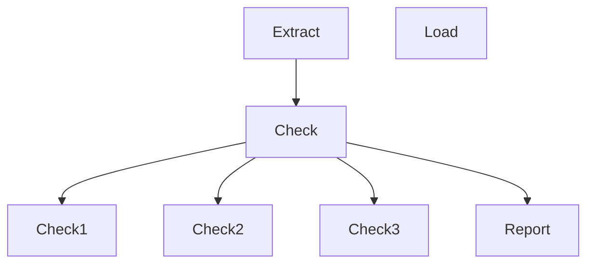

# Package
This is a Python Package for Contentdesk.io Report Portal

# Build package

py -m build

# Publish Test package

py -m twine upload --repository testpypi dist/*

## Test Package Install

https://test.pypi.org/project/contentdesk-report/0.0.1/

### Install Version
pip install -i https://test.pypi.org/simple/ contentdesk-report/==0.0.1

## Process

1. Extract: Get all Producs
2. Check
    2.1 Check Website
3. Create Report

